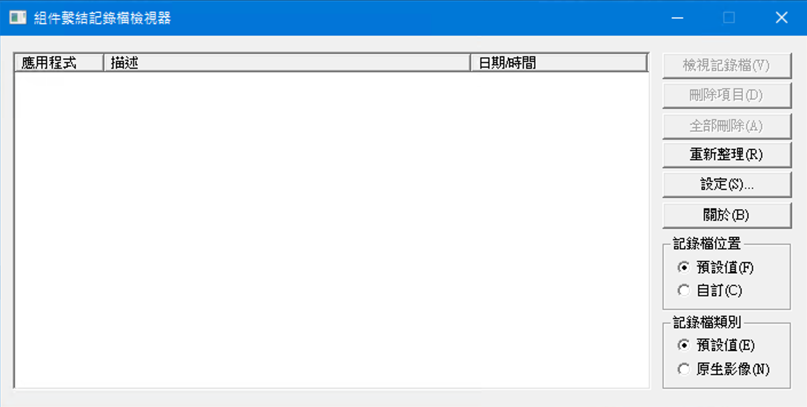
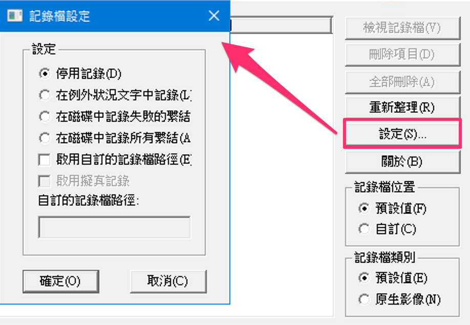
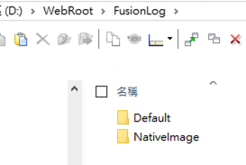
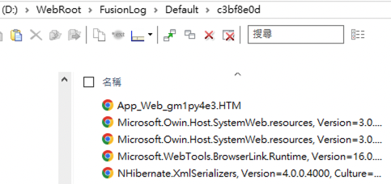
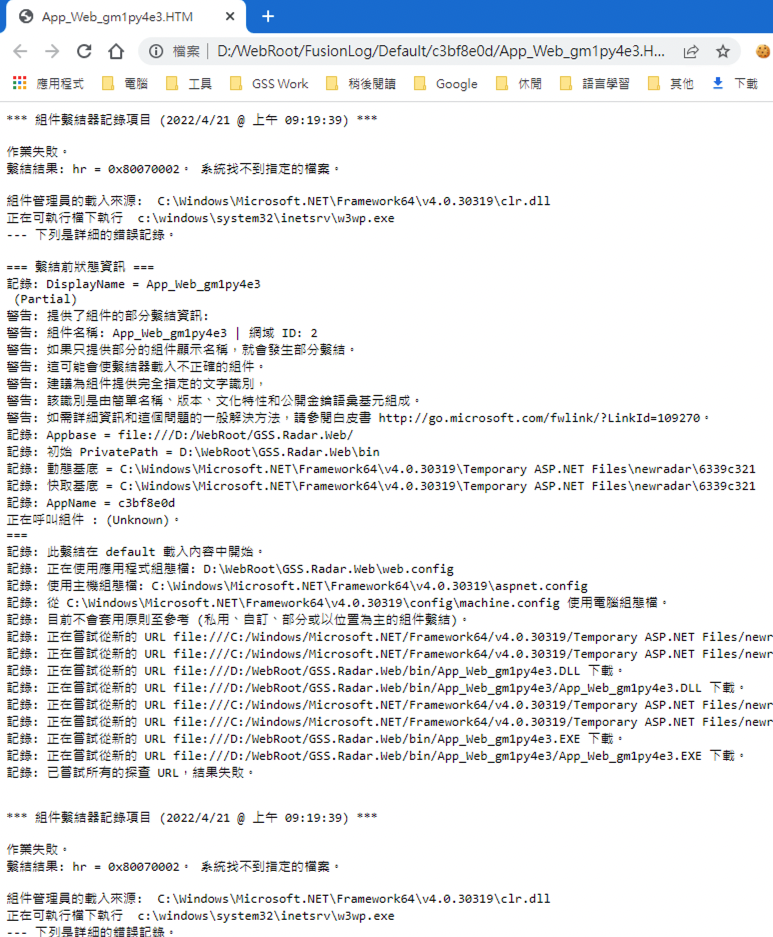

# .Net 程式參考遣失的偵錯紀錄(先行編譯網站參考遣失偵錯紀錄)

- 問題關鍵字

  > 檔案 'xxx' 尚未完成先行編譯，因此無法要求此檔案。
  >
  > The file 'xxx' has not been pre-compiled, and cannot be requested.
  
- 前情提要

  Asp.Net MVC 網站採先行編譯，在個人開發環境、公司測試環境執行都正常，但到了客戶端安裝後卻出現「檔案 'xxxx.cshtml' 尚未完成先行編譯，因此無法要求此檔案。」這樣的錯誤訊息。

  檢查了該 .cshtml 檔案，內容確實為「這是由先行編譯工具產生的資料標記檔，不應該加以刪除!」。

  在 bin 目錄中，也確實有該 .cshtml 的 .cshtml.compiled 檔，該 .cshtml.compiled 檔的內容 assembly 所以指定的 dll 也確實存在 bin 裡面，各個檔案權限都正常，也沒有被封鎖，一切看起來都很好，唯獨網站無法正常載入。

- 手動開啟組件繫結紀錄檔

  在 powershell 中，執行以下命令，將設定寫入機碼

  ```powershell
  #打開紀錄
  Set-ItemProperty -Path HKLM:\Software\Microsoft\Fusion -Name ForceLog -Value 0 -Type DWord
  Set-ItemProperty -Path HKLM:\Software\Microsoft\Fusion -Name LogFailures -Value 1 -Type DWord
  Set-ItemProperty -Path HKLM:\Software\Microsoft\Fusion -Name LogResourceBinds -Value 1 -Type DWord
  Set-ItemProperty -Path HKLM:\Software\Microsoft\Fusion -Name LogPath -Value 'D:\WebRoot\FusionLog\' -Type String
  mkdir D:\WebRoot\FusionLog\ -Force
  ```

  透過手動調整機碼的方式，啟用組件繫結紀錄，也可以透過 .NET Framework 的 fuslogvw.exe 工具做設定，但執行環境上不見得會有這個工具，所以主要還是用手動調整機碼的方式進行，以下為 fuslogvw.exe 的執行及設定畫面，設定中的選項，剛好可以應用回上述的機碼設定。

  

  如果要紀錄的對象是 IIS 網站，需要重新啟動 IIS 才會生效

  ```powershell
  iisreset
  ```

  紀錄到我們需要的 Log 之後，可以再透過以下的命令，移除相關機碼，移除後，**記得也要重啟 IIS 讓機碼生效**。

  ```powershell
  Remove-ItemProperty -Path HKLM:\Software\Microsoft\Fusion -Name ForceLog
  Remove-ItemProperty -Path HKLM:\Software\Microsoft\Fusion -Name LogFailures
  Remove-ItemProperty -Path HKLM:\Software\Microsoft\Fusion -Name LogResourceBinds
  Remove-ItemProperty -Path HKLM:\Software\Microsoft\Fusion -Name LogPath
  rmdir D:\WebRoot\FusionLog\ -Force
  ```

- 查看組件繫結紀錄

  在前面設定的 LogPath 目錄下，可以看到 .Net 程式執行後所產生的組件繫結紀錄如下：

   

  打開有問題的紀錄檔，可以從內容去查看問題所在：

  

  

- 參考資料

  > .NET Framework 工具：  https://docs.microsoft.com/zh-tw/dotnet/framework/tools/
  >
  > The file has not been pre-compiled, and cannot be requested (Solved)： https://port135.com/file-has-not-been-pre-compiled-and-cannot-be-requested/
  >
  > Fusion Log Viewer： https://techcommunity.microsoft.com/t5/iis-support-blog/fusion-log-viewer-fuslogvw-exe/ba-p/784396
  >
  > Fuslogvw.exe (組件繫結記錄檔檢視器)： https://docs.microsoft.com/zh-tw/dotnet/framework/tools/fuslogvw-exe-assembly-binding-log-viewer
  >
  > What is Fuslogvw EXE?： https://bridgitmendlermusic.com/what-is-fuslogvw-exe/
  >
  > How to enable assembly bind failure logging (Fusion) in .NET： https://stackoverflow.com/a/33013110
  >
  > 建立或找到 fuslogvw.exe 的替代方案，又名 Fusion Assembly Binding Log Viewer： https://www.796t.com/post/aDJ2c3c=.html
  >
  > Fusion++： https://github.com/awaescher/Fusion

  