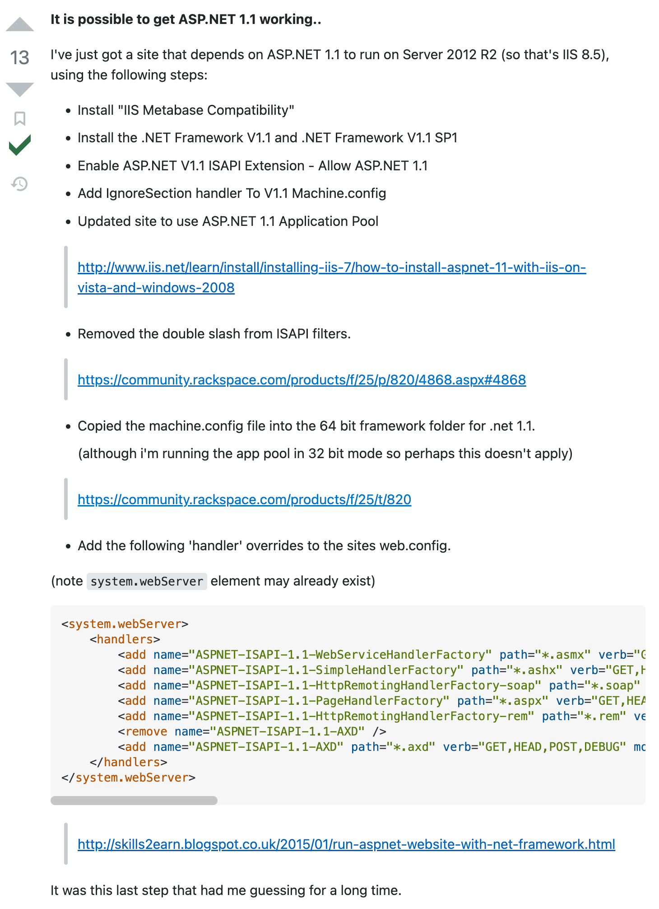

# 舊瓶新裝之在 Windows Server 2012R2 上安裝 asp.net 1.1
###### 說明
由於年代久遠，即便找到一些文章，很多文章內附的連結也已經連不上了，方法大致上都一樣，操作方式可以看參考資料，這邊只是補充這個當下的一些資源。
- 去哪裡找 asp.net 1.1 SP1
	微軟有一個 [Microsoft®Update Catalog](https://www.catalog.update.microsoft.com/home.aspx) 的網站，裡面放的就是曾經的 Update KB 們，asp.net 1.1 SP1 的 KB 編號是「 KB867460 」，用他去這個網站尋找就可以找到下載點。
- 安裝完 asp.net 1.1 、 asp.net 1.1 SP1 但應用程式集區沒得選的時候，可以在 .net 1.1 路徑下執行 aspnet_regiis.exe -i
```
	%windir%\Microsoft.NET\Framework\v1.1.4322\aspnet_regiis.exe -i
```
- 具體我不知道為什麼需要的步驟(據說是 64 位元的關系?) 

  [_Copied the machine.config file into the 64 bit framework folder for .net 1.1._](https://stackoverflow.com/a/31727988)
```
	mklink /d c:\Windows\Microsoft.NET\Framework64\v1.1.4322 c:\Windows\Microsoft.NET\Framework\v1.1.4322	
```
- 截錄 handlers 內容，方便複製，也可以放到系統預設的 [ApplicationHost.config](https://docs.microsoft.com/en-us/iis/get-started/planning-your-iis-architecture/introduction-to-applicationhostconfig?WT.mc_id=DOP-MVP-37580)，路徑如下：
```
	%windir%\system32\inetsrv\config\ApplicationHost.config
```
```xml
<system.webServer>
    <handlers>
        <add name="ASPNET-ISAPI-1.1-WebServiceHandlerFactory" path="*.asmx" verb="GET,HEAD,POST,DEBUG" modules="IsapiModule" scriptProcessor="C:\Windows\Microsoft.Net\Framework\v1.1.4322\aspnet_isapi.dll" resourceType="Unspecified" preCondition="classicMode,runtimeVersionv1.1,bitness32" />
        <add name="ASPNET-ISAPI-1.1-SimpleHandlerFactory" path="*.ashx" verb="GET,HEAD,POST,DEBUG" modules="IsapiModule" scriptProcessor="C:\Windows\Microsoft.Net\Framework\v1.1.4322\aspnet_isapi.dll" resourceType="Unspecified" preCondition="classicMode,runtimeVersionv1.1,bitness32" />
        <add name="ASPNET-ISAPI-1.1-HttpRemotingHandlerFactory-soap" path="*.soap" verb="GET,HEAD,POST,DEBUG" modules="IsapiModule" scriptProcessor="C:\Windows\Microsoft.Net\Framework\v1.1.4322\aspnet_isapi.dll" resourceType="Unspecified" preCondition="classicMode,runtimeVersionv1.1,bitness32" />
        <add name="ASPNET-ISAPI-1.1-PageHandlerFactory" path="*.aspx" verb="GET,HEAD,POST,DEBUG" modules="IsapiModule" scriptProcessor="C:\Windows\Microsoft.Net\Framework\v1.1.4322\aspnet_isapi.dll" resourceType="Unspecified" preCondition="classicMode,runtimeVersionv1.1,bitness32" />
        <add name="ASPNET-ISAPI-1.1-HttpRemotingHandlerFactory-rem" path="*.rem" verb="*" modules="IsapiModule" scriptProcessor="C:\Windows\Microsoft.Net\Framework\v1.1.4322\aspnet_isapi.dll" resourceType="Unspecified" preCondition="classicMode,runtimeVersionv1.1,bitness32" />
        <remove name="ASPNET-ISAPI-1.1-AXD" />
        <add name="ASPNET-ISAPI-1.1-AXD" path="*.axd" verb="GET,HEAD,POST,DEBUG" modules="IsapiModule" scriptProcessor="C:\Windows\Microsoft.NET\Framework\v1.1.4322\aspnet_isapi.dll" resourceType="Unspecified" requireAccess="Script" preCondition="classicMode,runtimeVersionv1.1,bitness32" />
    </handlers>
</system.webServer>
```

###### 參考資料
- [Stackoverflow - Windows Server 2012 with ASP.net 1.1?](https://stackoverflow.com/a/29734570)

  

- [鳥毅的BLOG - 在Windows Server 2016安裝ASP.Net 1.1](https://blog.tenyi.com/2021/01/windows-server-2016aspnet-11.html)
