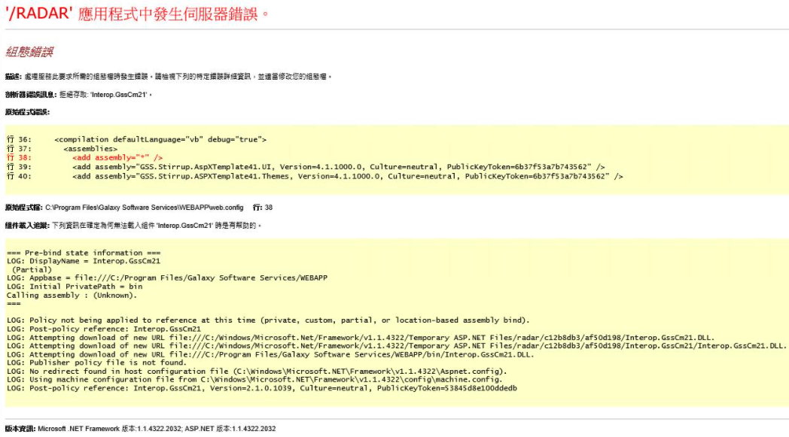

# 跟防毒軟體打架的 asp.net 1.1
###### 說明
好不容易在 [Windows Server 2012R2 上裝完 asp.net 1.1](install_aspnet11_on_windows_server_2012r2.md)，把應用程式掛上 IIS 後，卻出現怪異的現象，應用程式在載入 assembly 的時候，會時好時壞，說是無法載入組件，剖析器錯誤訊息為拒絕存取: "xxxx 組件"，而且還是隨機出現不同組件，錯誤訊息如下圖：

這種情況會懷疑是防毒軟體搞的鬼，因為防毒軟體的檔案即時監控機制，只要應用程式想要對檔案做 I/O 就會觸發掃描，可能是早期的 Framework 容錯機制比較不好，導致異常，這次遇到的情況，把防毒軟體停用後，就順利載入應用程式了。

###### 其他

一般企業防毒軟體有中央控管權限，沒辦法隨便關閉，如果可以進入安全模式，可以試著進去後，把防毒軟體安裝的目錄改名，重新開機後，防毒軟體就會無法執行，如果一時找不到 MIS 處理，可以用這種方式暫時停用來測試。

###### 參考資料
	沒有，純粹個人經驗。