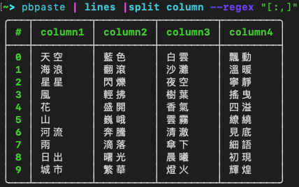
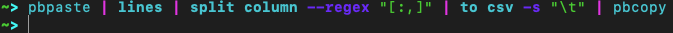
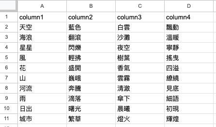

---
slug: clipboard-on-concole
title: macOS 如何在 Console 中使用剪貼簿的內容
authors: mrhihi
tags: [macOS, nushell, clipboard]
---

## 前情提要

工作中，時常會複製一堆文字資料到剪貼簿中，再貼到文字編輯器上做後製，如果這沱資料有表格結構到也好處理，偏偏有時候，它們就是一整沱：
``` 
天空:藍色,白雲:飄動
海浪:翻滾,沙灘:溫暖
星星:閃爍,夜空:寧靜
風:輕拂,樹葉:搖曳
花:盛開,香氣:四溢
山:巍峨,雲霧:繚繞
河流:奔騰,清澈:見底
雨:滴落,傘下:細語
日出:曙光,晨曦:初現
城市:繁華,燈火:輝煌
```
:::note
感謝 ChatGPT 友情贊助
:::

如上逗號的前後都有一組 Key:Value 的資料，  
想要把他們做成四欄資料放到 excel 上面去，有很多方式可以處理，  
但我常常在想，如果可以複製進剪貼簿後，再貼出來，就變成我想要的樣子該有多好。  

## 搭配 Nushell 試試

Nushell 可以用簡單的指令處理表格的資料，如果可以把剪貼簿的資料傳進 STDIO 讓 Nushell 處理，處理完後再複製回剪貼簿，感覺應該是個不錯的方式。
然後我找到了，在 macOS 下 pbpaste 跟 pbcopy 兩個好用的指令：

pbpaste: 把剪貼簿的內容貼到 STDIO  
pbcopy: 把 STDIO 輸出複製回剪貼簿  

於是：  
```
pbpaste | lines | split column --regex "[:,]"
```


接著只要把 table 轉成 Tab 分隔，然後再複製回剪貼簿就大工告成  

所以改一下語法  
```
pbpaste | lines | split column --regex "[:,]" | to csv -s "\t" | pbcopy
```
這個步驟因為是輸出到剪貼簿上，所以 Console 上不會有輸出  


然後我們就可以快樂的貼到 Excel 上了：  



# 參考資料
- https://ss64.com/mac/pbpaste.html
- https://ss64.com/mac/pbcopy.html
- https://www.nushell.sh/commands/docs/to_csv.html
- https://www.nushell.sh/commands/docs/split_column.html
