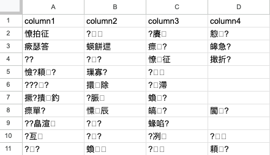

## 前情提要

[昨天提到](/blog/clipboard-on-concole) macOS 怎麼在 Console 中用指令使用剪貼簿的內容，因為平時工作是雙平台混合使用，所以好奇，在 Windows 下是不是有相應的實作，簡單的 ~~搜尋~~ 研究一下。

## Nushell 上場

首先，如何透過 Console 的命令取得剪貼簿的內容呢？
我 google 了一下，有找到幾種方式，一種是透過 PowerShell 的 Get-Clipboard ，一種是透過安裝 pasteboard ，還有其他的，但沒啥時間研究，先就這兩種分別說明。

### PowerShell Get-Clipboard

這個方法比較單純，不需要額外安裝其他工具。  
先把要處理的內容複製到剪貼簿中，接著打開 Nushell 並輸入這樣的指令

```shell
powershell get-clipboard | lines
```

然後我們就會得到這樣的錯誤訊息


編碼錯誤， Nushell 建議我們用 decode 去處理非 UTF-8 的字元

```shell
powershell get-clipboard | decode | lines | split column --regex "[:,]"
```

完美


接著再把結果輸入到剪貼簿中就可以打完收工了，輸入到剪貼簿這個動作，可以透過 Windows 內建的 Clip 指令完成

```shell
powershell get-clipboard | decode | lines | split column --regex "[:,]" | to csv -s "\t" | clip
```

執行完這行指令後，一樣沒有輸出，因為被導向剪貼簿裡面，立馬貼出來看看結果，於是我們就會得到 __一堆亂碼__ 。  


果然，怎麼來就要怎麼回去，加上編碼讓他轉回去 Big5 ，調整一下指令  

```shell
powershell get-clipboard | decode | lines | split column --regex "[:,]" | to csv -s "\t" | encode big5 | clip
```

貼上 Excel ，打完收工  


:::tip
可以透過 chcp 65001 ，讓 Console 編碼用 UTF-8 ，就可以不需要透過 decode 、 encode 做編碼轉換。  
要修改 Console 的預設編碼，可以參考 [這裡](https://www.thinkinmd.com/post/2020/02/21/command-prompt-and-windows-powershell-default-use-utf-8/) 。  
:::

### 安裝 pasteboard 使用 pbpaste & pbcopy

這個方法只差需要安裝程式，其他就跟 macOS 沒啥太大的差別(當然還是要處理編碼)。  
安裝的部份我選擇用 Chocolatey ，細簡請看 [這裡](https://community.chocolatey.org/packages/pasteboard#testingResults) 。  

```shell
choco install pasteboard
```

剩下的就參考 [昨天的指令](/blog/clipboard-on-concole) ，這裡就不多贅述了。  

## 參考資料

- https://ss64.com/ps/get-clipboard.html
- https://ss64.com/nt/clip.html
- https://community.chocolatey.org/packages/pasteboard#testingResults
- https://www.thinkinmd.com/post/2020/02/21/command-prompt-and-windows-powershell-default-use-utf-8/
