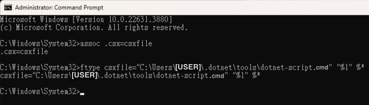

## 前情提要

dotnet-script 是一個可以把 C# 當成腳本執行的工具，我們可以簡單的寫一些 C# 的程式，不需要編譯，直接就可以執行，也可以在腳本程式中，指定要安裝的 nuget 套件，載入更多擴充功能，十分的好用。  
但有一個問題，在 Linux 或 macOS 的環境下，可以透過 [Shebang](https://zh.wikipedia.org/zh-tw/Shebang) 的方式，在 Console 中直接執行，但 Windows 不行，本篇文章會說明如何在 Windows Console 中，直接執行 csx 腳本，但針對如何安裝 dotnet-script 就不多加著墨，相關細節，請參考 [這裡](https://github.com/dotnet-script/dotnet-script) 。  

## Let's GO

首先，我們需要知道 dotnet-script.exe 的所在位置，輸入下面指令可以得到  

```shell
where dotnet-script.exe
```


接著，我們在這個位置裡面，新增一個 dotnet-script.cmd 的檔案，檔案內容如下圖  


```text
@dotnet-script.exe %*
```

最後就是 .csx 關聯到 dotnet-script 開啟，在 Console 提示列下輸入下面兩行指令  

```shell
assoc .csx=csxfile
ftype csxfile="C:\Users\[USER]\.dotnet\tools\dotnet-script.cmd" "%1" %*
```



:::warning
注意！這邊需要用 administrators 的權限執行。
:::

完成之後，就可以來試試看囉


## 參考資料

- https://github.com/dotnet-script/dotnet-script
- https://learn.microsoft.com/zh-tw/windows-server/administration/windows-commands/assoc
- https://learn.microsoft.com/zh-tw/windows-server/administration/windows-commands/ftype