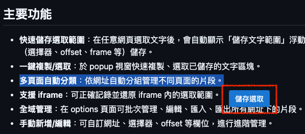

## 前情提要

身為一個 Chrome Extension 開發小白，不知道從何開始也是很正常的事，但手邊剛好有一個需求，評估可以用 Chrome Extension 來解決，於是就開始了這個小專案。  
現在正值 LLM 風頭浪尖上，運用 Vibe Coding 來開始一個 Chrome Extension 的開發，感覺是個不錯的選擇，也大大的降低了入門的門檻與學習的成本。  

## Let's GO

**[開發環境]** Visual Studio Code 開發必備的工具，我使用的是 [Roo-Code](https://github.com/RooCodeInc/Roo-Code) 這個套件， Visual Studio Code 跟 Roo-Code 網路上有太多實用的說明，這邊就不做介紹了。  

**[開工]** 首先建立一個新的資料夾，然後在 Visual Studio Code 中開啟這個資料夾，接著在 Roo-Code 的介面中，選擇「 Code 」模式，然後催動咒語：  

```text
實作一個 Chrome extension，目的是要讓使用者可以把網頁中選取的文字範圍透過 Selector 定位起迄並紀錄下來，再下次進入這個網頁的時候，可以透過先前紀錄的 Selector 定位出選取的文字範圍，並將文字內容複製到剪貼簿裡。
以下是各功能的描述
1. 網頁中選取文字時，會有浮動按鈕出現在滑鼠指標旁，點擊按鈕可以紀錄選取範圍的起迄 Selector 並依當前網址為集合儲存起來
2. popup 頁面中，如果沒有儲存過任何紀錄，要提示使用方式，如果有儲存過，則列舉出 selector ，每筆紀錄只顯示一行其餘的內容用 overflow hide 搭配捲軸的方式呈現，每筆紀錄下面提供以下功能
「複製」: 透過起迄 selector 複製選中的文字
「選取」: 透過起迄 selector 模擬文字選取
「編輯」: 讓使用者編輯起迄 selector 
「刪除」: 將該筆紀錄刪除
3. 選項頁面，在此頁面中做全域的設定，依不同網頁列出該網頁中的所有紀錄，每筆紀錄要提供編輯與刪除的功能
```

施咒畫面  


然後就是一連串的跑跑跑，如果沒有自動核准，就是時不是要去按一下核准按鈕  


全部跑完之後，就自動長出了一堆程式，過程中到底跑了什麼就不一一細說了，因為 LLM 就是會有他的隨機性，可能每次跑出來的程式碼都不太一樣，但大致上「應該」都是符合我們的需求~~吧?~~。  


接下來當然就是實測的環節了，再一次身為 Chrome Extension 開發小白的我，當然還是要問一下，怎麼開始部署測試囉。  
  
**[佈署]** 先把 Mode 切到 Ask 模式，然後問一下 Roo-Code：  

```text
怎麼把這個擴充功能掛進 Chrome 裡測試
```


好樣的，連路徑什麼的都幫我寫好了，直接照著做就對了。  
絲毫不費力的就要把擴充功能掛進 Chrome 裡了，但代誌不是憨人想得那麼簡單，不出意外的話馬上就要出意外了。  


會出意外這檔事，我們本來就不意外了，一樣把錯誤訊息貼上去，然後問 Roo-Code ，模式直接選 Code ，讓他幫我們修正。

```text
無法載入擴充功能
檔案
~/Local Workspace/GitHub/Chrome extension/HiTextClip2
錯誤
無法載入背景指令碼「background.js」。
無法載入資訊清單。
```


乖乖，直接幫我開一個空的 background.js ，裡面還幫我註解說「目前無需特殊背景邏輯，保留空檔案供 manifest 使用」。  
Roo-Code 處理完之後，擴充功能就成功掛進去 Chrome 了，  
但意外還是接踵而來，該有的功能沒出現，打開 DevTools 發現有錯誤：


接著不管出什麼錯，一律丟進去叫 Roo-Code 改：


然後他就成功了，但選取多行文字的時候，浮動按鈕飄得有點遠。




再次 Vibe Coding 一下，讓他幫我調整一下浮動按鈕的位置：

```text
浮動按鈕在選取多行文字的時候，沒有出現在滑鼠游標旁邊
```


然後整個過程就是這樣，反覆逐步的修正錯誤，直到功能都正常為止。  
過程中要注意的是， Prompt 要下得夠精準，這樣 LLM 才不會跑去錯的地方亂改一通，
再來就是，雖然有機會可以修到全部都正常，但其實還是要自己去看一下程式，因為在反覆的過程中，會殘留下很多我們意想不到的~~垃圾程式碼~~禮物。

## 結語

快！真的快，很厲害，著實是節省了不少時間，但也真的是要注意，不要留下技術債，畢竟 LLM 生成的程式碼，還是有可能會有一些不符合預期的地方。  
