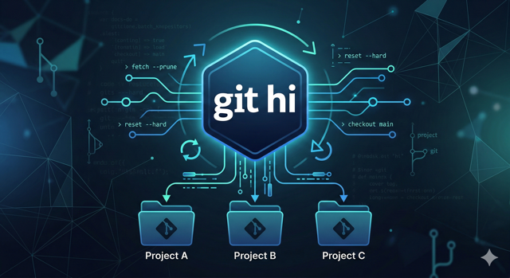

---
slug: git-hi-external-commands
title: Git 效率工具：git-hi | 利用 Git External Commands 打造整批自動化管理流
authors: mrhihi
tags: [git, git-external-commands]
image: ./18ofai18ofai18of.png
---

# Git 效率工具：git-hi | 利用 Git External Commands 打造整批自動化管理流

在開發流程中，我們經常會想「如果 Git 能幫我一次處理所有專案就好了」。**git-hi** 正是基於 Git 內建的強大擴充機制所開發的工具，旨在解決多 Repository 管理時的瑣事。

👉 **GitHub 專案頁面**：[https://github.com/mrhihi/git-hi](https://github.com/mrhihi/git-hi)



---

:::tip
這是一篇用 Gemini 自動產生的實戰筆記，內容涵蓋了從 Git External Commands 的概念，到如何利用 **git-hi** 進行多 Repository 管理的實戰技巧。

AI 生成的內容可能不夠精確或有誤，請讀者自行斟酌使用，並歡迎提供反饋以改進未來的內容品質。
:::

---

## 🔍 底層技術：什麼是 Git External Commands？

**git-hi** 並非獨立的程式，而是利用了 Git 的 **External Commands（外部指令）** 機制。

### 它是如何運作的？
Git 的設計哲學非常開放。當你在終端機輸入 `git xxx`時，Git 會遵循以下搜尋邏輯：
1. **內建指令**：檢查 `xxx` 是否為 Git 本身內建的指令（如 `push`, `pull`）。
2. **別名 (Alias)**：檢查 `.gitconfig` 中是否定義了名為 `xxx` 的別名。
3. **外部指令 (External Commands)**：這是最關鍵的一步。Git 會在系統的 **PATH 環境變數** 中尋找名稱為 **`git-xxx`** 的可執行檔。


---

## 📂 解決痛點：消除頻繁「進出目錄」的繁瑣步驟

在沒有 **git-hi** 之前，若要更新目錄下 5 個專案，你的操作流程通常如下：

1. `cd Project_A` -> `git pull` -> `cd ..`
2. `cd Project_B` -> `git pull` -> `cd ..`
3. ...(重複 5 次)

這種「進出、進出」的操作不僅浪費時間，且極容易出錯（例如漏掉某個專案，或在錯誤的目錄執行指令）。

### 整批操作情境 (Multi-Repo Management)

**git-hi** 的強大之處在於：**你完全不需要進入子目錄**。只要腳本已在系統 `PATH` 中，你只需待在「父目錄」即可。

**正確的配置示意：**

* **執行檔存放處 (PATH)**：

    * macOS: `/usr/local/bin/git-hi`
    * Windows: `C:\Tools\git-hi.cmd`

* **操作的工作目錄**：

    ```text
    /Workspaces/ (你只需待在這裡，不用進出子目錄)
      ├── Project_A/ (.git)
      ├── Project_B/ (.git)
      └── Project_C/ (.git)
    ```

### 為什麼「整批處理」很重要？

* **消除目錄切換成本**：透過 `git hi --pull all`，腳本會自動深入每個子目錄執行動作並返回。你只需輸入一次指令，就能完成原本需要 15 次的操作（5 次 cd in + 5 次 git + 5 次 cd out）。
* **同步狀態一致性**：確保整批相關聯的專案都處於最新的開發版本，避免版本落差導致的編譯錯誤。
* **快速環境重整**：切換大型 Feature 時，直接在父目錄輸入 `git hi --reset all` 即可。
* **衝突風險控管**：使用 `git hi --ls-conflicted all` 立刻掌握所有專案的健康狀況。

---

## 🚀 核心功能與應用場景

* **主分支命名自動化**：不論專案叫 `master` 還是 `main`，**git-hi** 會動態偵測，不需手動判斷。
* **清理無效追蹤**：一併移除遠端已刪除但在本地殘留的無效紀錄（Gone）。

---

## 🛠 安裝與設定

### macOS (Unix)

1. 從 GitHub 下載 `git-hi` 腳本。
2. 移動至 `/usr/local/bin` 並賦予權限：`chmod +x /usr/local/bin/git-hi`。

### Windows

1. 下載 `git-hi.cmd` 並加入系統環境變數 `PATH`。
2. 執行：`git config --global alias.hi "!git-hi.cmd"`。

---

## 💡 指令實戰範例

* **智慧重置主分支**：`git hi --reset all`
* **強力清理並更新**：`git hi --force --pull all`
* **清理無效分支**：`git hi --prune all`
* **整批衝突檢索**：`git hi --ls-conflicted all`

---

## 📈 結語

**git-hi** 的價值在於將「判斷邏輯」與「路徑切換」交給腳本。透過整批處理的能力，徹底解放開發者在多 Repo 管理時的重複勞動。

🔗 **GitHub**：[mrhihi/git-hi](https://github.com/mrhihi/git-hi)
